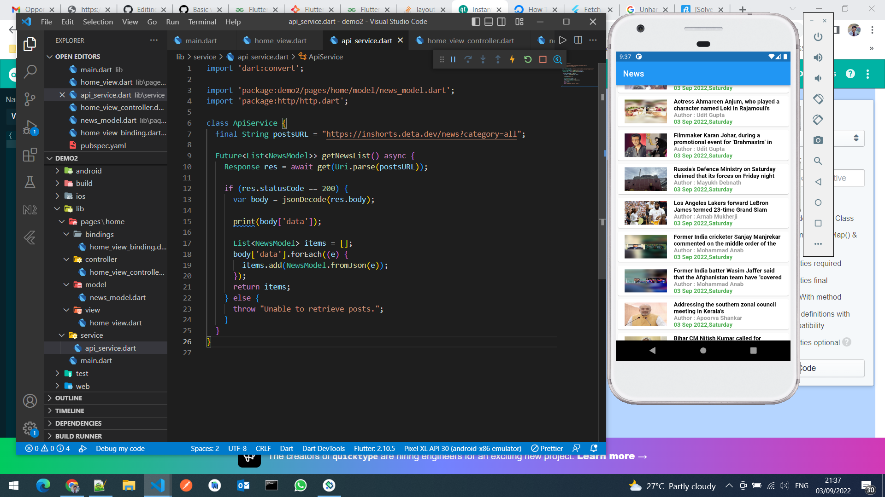
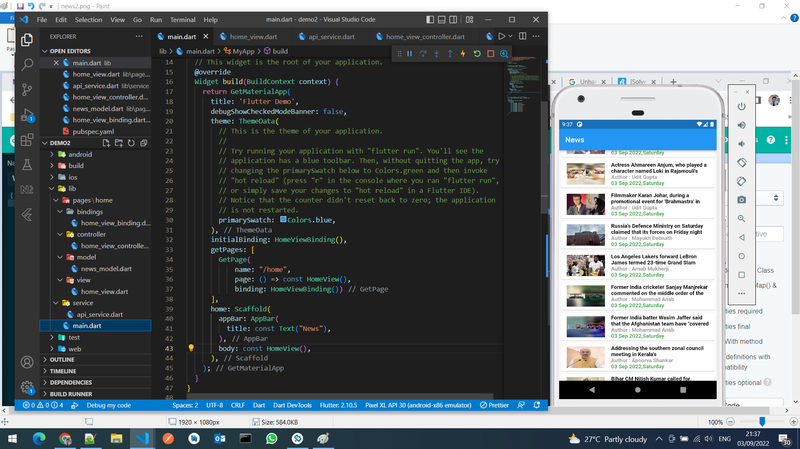

# Coding Questions:

## 1. Refactor the code below so that the children will wrap to the next line when the display width is small for them to fit.

<picture>
  <source media="(prefers-color-scheme: dark)" srcset="wrap%20to%20next%20line.png">
  <source media="(prefers-color-scheme: light)" srcset="wrap%20to%20next%20line.png">
  
</picture>

## 2. Write a function to call the below mentioned API and parse the data. Make sure the function return an object of News item, which contains News article Title, News article Content, Date of News Published, Banner Image of News article.
[https://inshorts.deta.dev/news?category=all](https://inshorts.deta.dev/news?category=all)

<picture>
  <source media="(prefers-color-scheme: dark)" srcset="news1.png">
  <source media="(prefers-color-scheme: light)" srcset="news1.png">
  
</picture>

<picture>
  <source media="(prefers-color-scheme: dark)" srcset="news2.png">
  <source media="(prefers-color-scheme: light)" srcset="news2.png">
  
</picture>

<picture>
  <source media="(prefers-color-scheme: dark)" srcset="news3.png">
  <source media="(prefers-color-scheme: light)" srcset="news3.png">
  
</picture>

## 3. Write a function to call the below mentioned API and parse the data. Make sure the function return an object of News item, which contains News article Title, News article Content, Date of News Published, Banner Image of News article.
